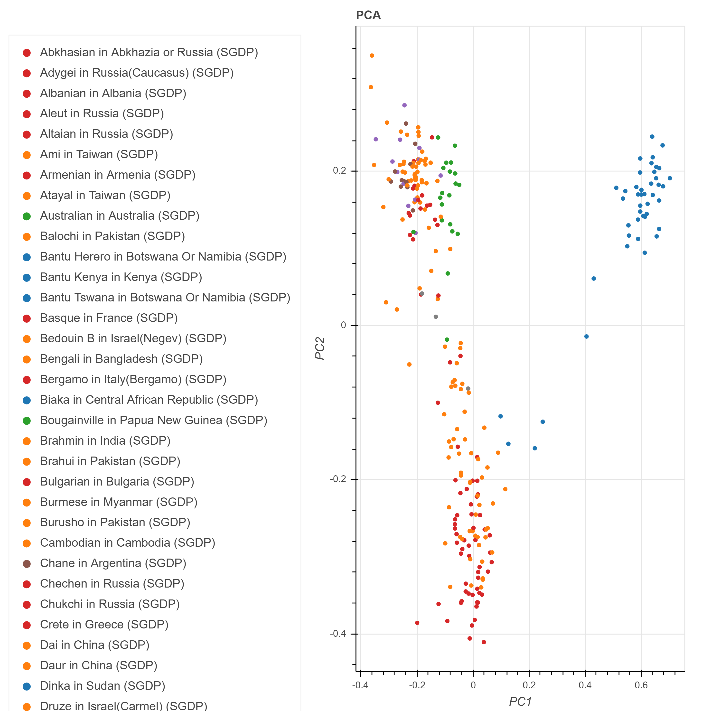

<h1 align="center"> @DIB-LAB/The Great Genotyper </h1>
<details>
<summary>📖 Table of Contents</summary>
<br />

[](#table-of-contents)

## ➤ Table of Contents

- [➤ Table of Contents](#-table-of-contents)
- [➤ Introduction](#-introduction)
- [➤ Quick Installation](#-quick-installation-pip)
- [➤ Build from source](#-build-from-source)
  - [Clone](#clone)
  - [Install dependencies](#install-dependencies)
  - [Build](#build)
    - [CMake options](#cmake-options)
    - [**Build The kProcessor Library**](#build-the-kprocessor-library)
    - [**Build Everything**](#build-everything)
- [➤ Manually build the Python bindings](#-manually-build-the-python-bindings)
  - [Generate bindings](#generate-bindings)
- [➤ Contributors](#-contributors)
- [➤ License](#-license)

</details>

[](#introduction)

## ➤ Introduction

**The Great Genotyper** is  a mapping-free population genotyping. GG uses metagraph to index the population of samples using its kmer content; indexing runs once per population. For each SV to be genotyped, GG uses pangenie model to genotype SV based on the kmer counts for its marker kmers. Finally, GG will improve the results further using the imputation model based on the genotyping results. In conclusion, GG can accurately estimate AF using the same resources as variant calling pipelines.

[](#quick_installation)

## ➤ Quick Installation

Download the [precompiled binary Linux-x86_64](https://github.com/dib-lab/TheGreatGenotyper/releases/download/untagged-6f4ca3f2f787ecf0e1e0/TheGreatGenotyper)

[](#build_source)

## ➤ Build from source

### Clone

```bash
git clone https://github.com/dib-lab/TheGreatGenotyper.git
cd TheGreatGenotyper/
```


### Install dependencies

```bash
conda env create -f environment.yml
conda activate gg
conda env config vars set CPATH=${CONDA_PREFIX}/include:${CPATH}
conda activate
conda activate gg
```

### Build

```bash=
# Run CMake configure
cmake -Bbuild

# Run make with parallel execution.
cmake --build build -j4 # -j4 = execute 4 recipes simultaneously.
```

### Download Beagle


```
wget https://faculty.washington.edu/browning/beagle/beagle.22Jul22.46e.jar
wget https://bochet.gcc.biostat.washington.edu/beagle/genetic_maps/plink.GRCh38.map.zip
unzip plink.GRCh38.map.zip 

```


</details>

[](#manual_build_python)

## ➤ Run 
### Prepare Input Data
uncompress test_data
```
gzip -d test_data/GRCh38_chr21.fa.gz test_data/test.vcf.gz  test_data/test.unphased.vcf.gz

```
Download index(50G) for Simons Genome Diversity population([SGDP](https://www.nature.com/articles/nature18964)). 

```
mkdir -p index/SGDP/
cd index/SGDP/
wget https://farm.cse.ucdavis.edu/~mshokrof/SGDP/graph.dbg
wget https://farm.cse.ucdavis.edu/~mshokrof/SGDP/graph.desc.tsv
wget https://farm.cse.ucdavis.edu/~mshokrof/SGDP/annotation.relaxed.row_diff_int_brwt.annodbg
wget https://farm.cse.ucdavis.edu/~mshokrof/SGDP/samples.csv
cd -
echo "index/SGDP/" > indexes
```
 To use this script with the HGDP dataset as well: Download the HGDP indexes from https://farm.cse.ucdavis.edu/~mshokrof/indexes/ and add the folder name to the 'indexes' file.

 You can find the metadata for the samples in the index at 

### Running

The figure provides an overview of the various workflows utilized in the Great Genotyper. This includes three distinct workflows to create reference panels, each illustrated with a different color of the arrow: The Red workflow creates a high-quality reference panel from phased variants, the green workflow creates the panel from variants without phasing information, and the blue workflow enhances the green panel by phasing the input variants then following the red workflow. Each of these workflows utilizes three specific processes: Unique k-mer Extractor, Extract Phasing Information, and High-Quality Genotype. These procedures are based on a scaled-up version of the Pangenie model, which enables the simultaneous processing of thousands of samples. “Population Genotype correction and phasing” scrutinize genotypes by evaluating the genotyping quality across all samples. Once completed, the removed genotypes are re-estimated using a statistical imputation process, implemented by Beagle. Beagle also uses the results from the population genotype to phase all variants, thereby generating a reference panel based on the input variants. Lastly, “Fast genotyping” produces initial genotypes  for all the samples in the population database by comparing the k-mer counts of unique k-mers to the average sample coverage.


#### High Quality Genotyping for phased variants(red arrow):
Run The great genotyper. It took  12 mins using 32 core and 85GB ram.
```
mkdir test_output

./build/pangenie/src/TheGreatGenotyper -g  -i indexes  -j 32 -t 32 -r test_data/GRCh38_chr21.fa  -y  emissions -v test_data/test.vcf -o - 2> log | bgzip > test_output/test.vcf.gz
tabix -p vcf test_output/test.vcf.gz

java -Xmx40G -jar beagle.22Jul22.46e.jar gt=test_output/test.vcf.gz out=test_output/test.phased nthreads=32  map=plink.chr21.GRCh38.map
tabix -p vcf test_output/test.phased.vcf.gz

bcftools +fill-tags test_output/test.phased.vcf.gz -Oz  -o test_output/test.phased.tagged.vcf.bgz -- -t all
tabix -p vcf test_output/test.phased.tagged.vcf.bgz
 
```
#### Fast Genotyping for variants without phasing(green arrow):
Note: "-a" parameter is added to use kmer-only genotyping model.

```
mkdir test_output

./build/pangenie/src/TheGreatGenotyper -a -g  -i indexes  -j 32 -t 32 -r test_data/GRCh38_chr21.fa  -y  emissions -v test_data/test.unphased.vcf -o - 2> log | bgzip > test_output/test.vcf.gz
tabix -p vcf test_output/test.vcf.gz

java -Xmx40G -jar beagle.22Jul22.46e.jar gt=test_output/test.vcf.gz out=test_output/test.phased nthreads=32  map=plink.chr21.GRCh38.map
tabix -p vcf test_output/test.phased.vcf.gz

bcftools +fill-tags test_output/test.phased.vcf.gz -Oz  -o test_output/test.phased.tagged.vcf.bgz -- -t all
tabix -p vcf test_output/test.phased.tagged.vcf.bgz
 
```

#### Second pass Genotyping for variants without phasing(blue arrow):
After running the Green workflow, Use the workflow output to phase the input variants and rerun the great genotyper as in the red workflow

```
java -Xmx40G -jar beagle.22Jul22.46e.jar gt=test_data/test.unphased.vcf ref=test_output/test.phased.vcf.gz out=test_data/test.GG.phased nthreads=32  map=plink.chr21.GRCh38.map
gzip -d test_data/test.GG.phased.vcf.gz

./build/pangenie/src/TheGreatGenotyper -g  -i indexes  -j 32 -t 32 -r test_data/GRCh38_chr21.fa  -y  emissions -v test_data/test.GG.phased.vcf -o - 2> log | bgzip > test_output/secondpass.vcf.gz
tabix -p vcf test_output/secondpass.vcf.gz

java -Xmx40G -jar beagle.22Jul22.46e.jar gt=test_output/secondpass.vcf.gz out=test_output/secondpass.phased nthreads=32  map=plink.chr21.GRCh38.map
tabix -p vcf test_output/secondpass.phased.vcf.gz

bcftools +fill-tags test_output/secondpass.phased.vcf.gz -Oz  -o test_output/secondpass.phased.tagged.vcf.bgz -- -t all
tabix -p vcf test_output/secondpass.phased.tagged.vcf.bgz

```


#### Postprocessing


Query the frequent variants
```
bcftools view  -q 0.9 test_output/test.phased.tagged.vcf.bgz |grep -vP "^#" |head
```

Query the rare variants
```
bcftools view  -Q 0.1 test_output/test.phased.tagged.vcf.bgz |grep -vP "^#" |head
```

[](#manual_build_python)

## ➤ Advanced post-processing

Manipulating VCF files containing genotypes for hundreds or thousands of samples can be a challenging task. To effectively navigate and analyze such data, we recommend utilizing Hail as a tool for exploring the resulting VCF file. I prepared a [jupyter notebook](https://github.com/dib-lab/TheGreatGenotyper/blob/master/DownstreamAnalysis.ipynb) containing examples of tasks to be done using hail like: stratifying allele frequencies by population, and plotting the PCA of the genotypes. The following figure is the PCA plot generated by Hail using "test_output/merged.vcf.bgz"  

To run the [notebook](https://github.com/dib-lab/TheGreatGenotyper/blob/master/DownstreamAnalysis.ipynb), 
You need to install :

1. jupyter: https://jupyterlab.readthedocs.io/en/stable/getting_started/installation.html 
2. Hail: https://hail.is/docs/0.2/getting_started.html 

The notebook needs two input files: vcf file("test_output/test.phased.tagged.vcf.bgz") and [samples description](https://farm.cse.ucdavis.edu/~mshokrof/SGDP/samples.csv).


[](#contributors)

## ➤ Contributors

Moustafa Shokrof

C.Titus Brown

Tamer Mansour

[](#license)

## ➤ License

Licensed under [BSD-3-Clause](https://opensource.org/licenses/BSD-3-Clause).
