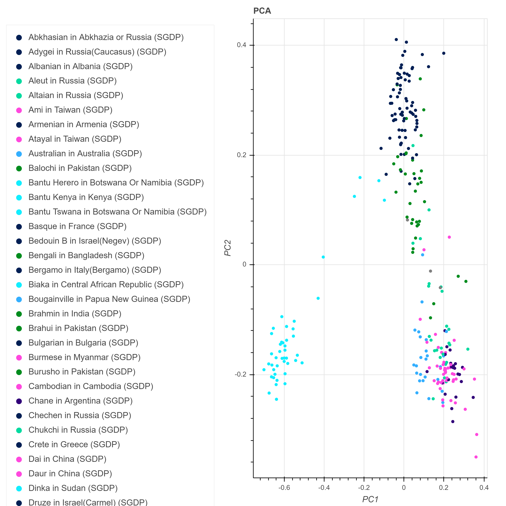

<h1 align="center"> @DIB-LAB/The Great Genotyper </h1>
<details>
<summary>📖 Table of Contents</summary>
<br />

[](#table-of-contents)

## ➤ Table of Contents

- [➤ Table of Contents](#-table-of-contents)
- [➤ Introduction](#-introduction)
- [➤ Quick Installation](#-quick-installation-pip)
- [➤ Build from source](#-build-from-source)
  - [Clone](#clone)
  - [Install dependencies](#install-dependencies)
  - [Build](#build)
    - [CMake options](#cmake-options)
    - [**Build The kProcessor Library**](#build-the-kprocessor-library)
    - [**Build Everything**](#build-everything)
- [➤ Manually build the Python bindings](#-manually-build-the-python-bindings)
  - [Generate bindings](#generate-bindings)
- [➤ Contributors](#-contributors)
- [➤ License](#-license)

</details>

[](#introduction)

## ➤ Introduction

**The Great Genotyper** is  a mapping-free population genotyping. GG uses metagraph to index the population of samples using its kmer content; indexing runs once per population. For each SV to be genotyped, GG uses pangenie model to genotype SV based on the kmer counts for its marker kmers. Finally, GG will improve the results further using the imputation model based on the genotyping results. In conclusion, GG can accurately estimate AF using the same resources as variant calling pipelines.

[](#quick_installation)

## ➤ Quick Installation

Download the [precompiled binary Linux-x86_64](https://github.com/dib-lab/TheGreatGenotyper/releases/download/untagged-6f4ca3f2f787ecf0e1e0/TheGreatGenotyper)

[](#build_source)

## ➤ Build from source

### Clone

```bash
git clone https://github.com/dib-lab/TheGreatGenotyper.git
cd TheGreatGenotyper/
```


### Install dependencies

```bash
conda env create -f environment.yml
conda activate gg
conda env config vars set CPATH=${CONDA_PREFIX}/include:${CPATH}
conda activate
conda activate gg
```

### Build

```bash=
# Run CMake configure
cmake -Bbuild

# Run make with parallel execution.
cmake --build build -j4 # -j4 = execute 4 recipes simultaneously.
```


</details>

[](#manual_build_python)

## ➤ Run 
uncompress test_data
```
gzip -d test_data/GRCh38_chr21.fa.gz test_data/test.vcf.gz
```
Download index(50G) for Simons Genome Diversity population([SGDP](https://www.nature.com/articles/nature18964))

```
mkdir -p index/SGDP/
cd index/SGDP/
wget https://farm.cse.ucdavis.edu/~mshokrof/SGDP/graph.dbg
wget https://farm.cse.ucdavis.edu/~mshokrof/SGDP/graph.desc.tsv
wget https://farm.cse.ucdavis.edu/~mshokrof/SGDP/annotation.relaxed.row_diff_int_brwt.annodbg
wget https://farm.cse.ucdavis.edu/~mshokrof/SGDP/samples.csv
cd -
```

Run The great genotyper. It took  12 mins using 32 core and 85GB ram.
```
mkdir test_output
./build/pangenie/src/TheGreatGenotyper -j 32 -t 32 -a index/SGDP/annotation.relaxed.row_diff_int_brwt.annodbg -f index/SGDP/graph.desc.tsv -g -i index/SGDP/graph.dbg -r  test_data/GRCh38_chr21.fa  -v test_data/test.vcf -o test_output/test  &> test_output/log
```

Postprocessing
```
parallel --gnu 'bgzip {} && tabix -p vcf {}.gz' ::: test_output/test_*_genotyping.vcf
scripts/populationMerge.sh test_output/merged.vcf.bgz test_output/test_*_genotyping.vcf.gz
```

Query the frequent variants
```
bcftools view  -q 0.9 test_output/merged.vcf.bgz |grep -vP "^#" |head
```

Query the rare variants
```
bcftools view  -Q 0.1 test_output/merged.vcf.bgz |grep -vP "^#" |head
```

[](#manual_build_python)

## ➤ Advanced post processing

Manipulating VCF files containing genotypes for hundreds or thousands of samples can be a challenging task. To effectively navigate and analyze such data, we recommend utilizing Hail as a tool for exploring the resulting VCF file. I prepared a [jupyter notebook](https://github.com/dib-lab/TheGreatGenotyper/blob/master/DownstreamAnalysis.ipynb) containing examples of tasks to be done using hail like: stratifying allele frequencies by population, and plotting the PCA of the genotypes. The following figure is the PCA plot generated by Hail using "test_output/merged.vcf.bgz"  

To run the [notebook](https://github.com/dib-lab/TheGreatGenotyper/blob/master/DownstreamAnalysis.ipynb), 
You need to install :

1. jupyter: https://jupyterlab.readthedocs.io/en/stable/getting_started/installation.html 
2. Hail: https://hail.is/docs/0.2/getting_started.html 

The notebook needs two input files: vcf file("test_output/merged.vcf.bgz") and [samples description](https://farm.cse.ucdavis.edu/~mshokrof/SGDP/samples.csv).




[](#contributors)

## ➤ Contributors

Moustafa Shokrof

C.Titus Brown

Tamer Mansour

[](#license)

## ➤ License

Licensed under [BSD-3-Clause](https://opensource.org/licenses/BSD-3-Clause).
